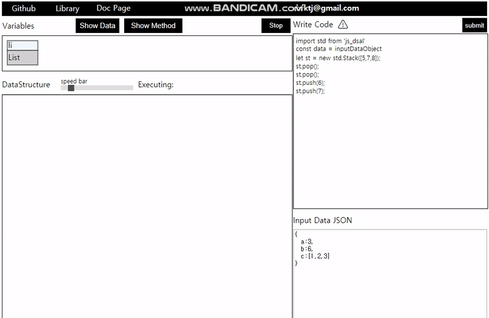
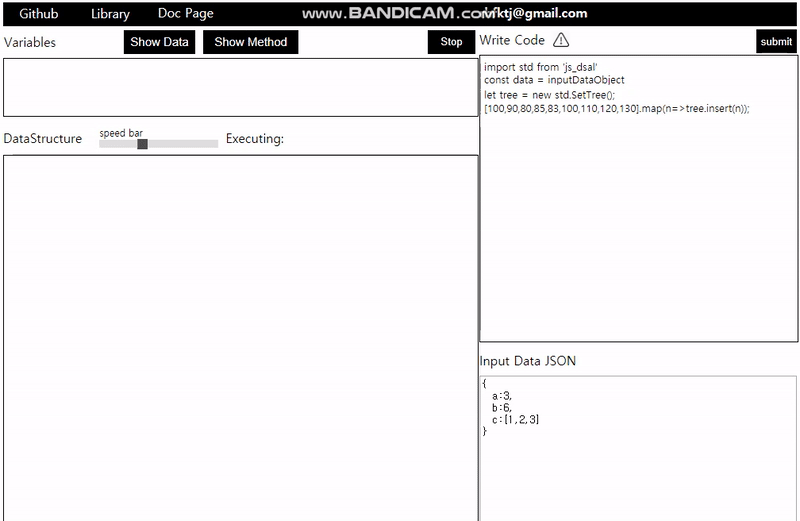

# **Javascript Data Structure Visualization**
- Web Page made by react

### **[Homepage Address](https://hongjisung.github.io/JS_DataStructure_Visualization/)**

### **[Library Document Homeage](https://hongjisung.github.io/DataStructure/)**

## **PurPose**
Show how working javascript data structure method in given code.  

Write down the javascript code using **Data Structure Library**([js_dsal](https://github.com/hongjisung/DataStructure)).  

This Page will show you how the data structure method working with animation.

### **[Data Structure Library Repository](https://github.com/hongjisung/DataStructure)**

### **Install dependencies**
```
yarn build
```
**Precaution**  
For deploy webpage, It should be done that change package.json homepage to "."  
If not, the relative path make error.

### **Run Page**
```
npm start
```

## **Implement Static Data Structure**
- **List**

## **Implemented Method**
### **list**
- pushBack
- popBack
- pushFront
- popFront  


### **Stack**
- push
- pop  



### **queue**
- push
- pop  


### **priority queue**
- push
- pop


### **SetTree**
- insert



### **MultiSetTree**
- insert


### **MapTree**
- insert


### **MultiMapTree**
- insert
